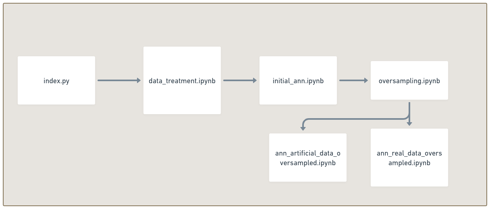

[](https://www.python.org/downloads/release/python-3106/)


# 3W Artificial neural network - Quick loss of productivity

This work intents to perform feature selection over [3W dataset](https://github.com/petrobras/3W) and create ANN(artificial neural networks) from it's results. For the porpuse of this work, Lasso Regression and PCA(Principal Component Analysis) were used for feature selection and feature extraction(respectively). MLPClassifier (Multilayer Perceptron Classifier) was used to generate ANN models. 

Since the 3W dataset contains a series of events reported, this work will keep focus to event 5: quick loss of productivity(from portuguese "Perda rápida de Produtividade" or PRP).

This work is a graduation thesis for the course of chemical engineering at the Pontifical University of Rio de Janeiro (PUC-RIO).


## How this project works.

This repository contains a series of python's colab notebooks(5), each with a specific responsability for the data analysis, the relashionship between the files is shown on the figure below.



- `index.py`: This is the only python file that is not in a colab notebook.This file's responsability is to create a macro dataset with only the classes 0 and 5 from real operations.
- `data_treatment.ipynb`: From the macro dataset, this notebook performs feature selection emphasizing importante informations from the executions as markdowns. At the end, the notebook creates three datasets for each inference from the methods applied, those datasets are splitted into train and test for subsequent analysis.
-   `initial_ann.ipynb`: The first models of ANN are generated for each case from `data_treatment.ipynb` , ending up indicating the need for oversampling.
-   `oversampling.ipynb`: Uses SMOTE(Synthetic Minority Oversampling Technique) tecnique for oversampling with artificial data and uses real data from 3W to increase number of 0 classes. Creates splitted datasets for artificial and real oversample, to be analysed individually.
-   `ann_artificial_data_oversampled.ipynb`: Creates ANN for  dataset oversampled with artificial data.
-   `ann_real_data_oversampled.ipynb`: Creates ANN for dataset oversampled with real data.

Obs: The `utils.py` provides some code to be shared across the notebooks.


## Data Treatment:
One of the most important steps of data science is data treatment, therefore the `data_treatment.ipynb` has the responsability to investigate over the data acquired and remove or fill out, if necessary, missing data. 
From the feature selection and feature extraction methods performed, 3 possible cases were inferred:
1. Case 1: All features(except for T-JUS-CKGL) are important and must not be disregarded.
2. Case 2: All the features, except for T-TPT and P-MON-CKP (and T-JUS-CKGL), should be considered. 
3. Case 3: All the features, except for P-TPT and P-MON-CKP (and T-JUS-CKGL), should be considered.
Obs: T-JUS-CKGL was removed from all analysis since it did not have data that could be of value for the analysis (all values were zero).

## How to run:

This project was thought to run locally with, expecting to present a better performance in local machines, however it's possible to run it on a google colab environment, however some changes should be considered:
1. All notebooks read and write local CSV files, therefore, if you intent to run it online, consider using `google.drive` library and mount your drive at the beginning of every notebook, such as: 

```py
from google.colab import drive

drive.mount('/content/drive')
```
Furthermore, all paths to csv files must be changed to follow google drive's path.

2. The only file that must run before all is `index.py`, this file creates `main_class_five_&_zero.csv`, wich is used along the project, so run it on a colab notebook or locally as you wish.
`
3. This repository contemplates all csv created, except for `main_class_five_&_zero.csv`, since it is way to big to be transfered into github, so feel free to run your own simulation and save new models into `./ann_models`, but don't forget to change your relative paths.

### How to run locally:

If you are used to run python code locally, skip the first steps of this topic. 

Google Colaboratory provides many dependencies to quickstart data analysis, however those dependencies are not contemplated locally and you must install then.

One of the best tools to run code locally(and free) is VisualStudio Code, check out the [download](https://code.visualstudio.com/download) for more informationd. I strongly recomend the usage of this tools, however, feel free to use other editors such as [pycharm](https://www.jetbrains.com/pt-br/pycharm/), [sublime](https://www.sublimetext.com/3), [spider](https://www.spyder-ide.org/)...But keep in mind that the next steps were tought to run on VSCode and some may be different depending on your text editor.

1. Python installation.

    If you're a windows user and haven't installed python, check the language website for [download](https://www.python.org/downloads/), for reference, this project uses python 3.10.6.

2. pyenv (optional):

    For python's [version](http://blog.abraseucodigo.com.br/instalando-qualquer-versao-do-python-no-linux-macosx-utilizando-pyenv.html) management, I recomend using pyenv, wich allows you to install multiple python versions to run your code locally.

3. Installing dependencies:
    If you're using VSCode, open a terminal by clicking Terminal on the upper menu and going to "New terminal" and run:
    ```bash
    pip install -r requirements.txt
    ```
    This command install all the dependencies in the file `requirements.txt`

Now you're ready to go! 

